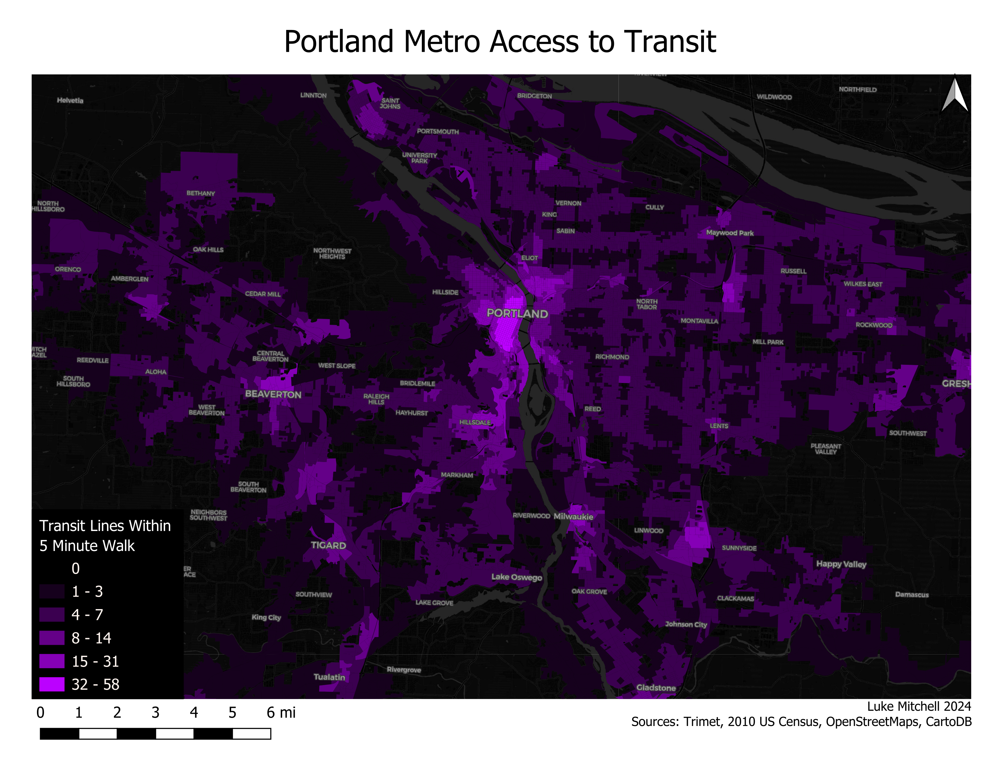
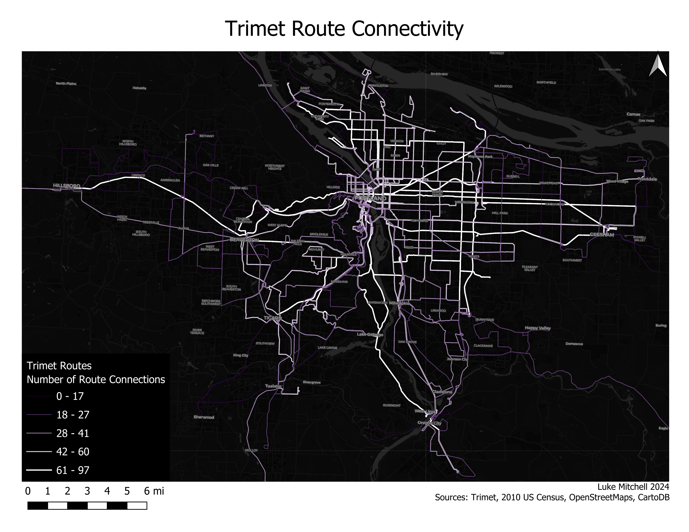

# Portland Transit Connectivity Map

Mapping the Portland metro area's connectivity via public transit  

# About

Creating a choropleth map of the Portland metro area by each census block's access to transit route stops within a five minute walk and a graduated symbols map of each public transit line's number of connections to other routes within the network.
 
To create the script I used publicly available public transit route and stop locations from trimet, as well as census blocks from the 2010 US Census. 
  
The GenerateTransitScore script augments the attributes of the block layer with a count of how many transit stops with unique routes can be reached through a shortest path network analysis call, and which routes are reachable.
 
The GenerateRouteConnectivityScore script buffers 300 feet around all stops on a transit route and to find how many other stops with unique routes are accessible nearby. 

## [Repository](https://github.com/LukeMitchell-N/PortlandTransitConnectivityMap/tree/main)

## Image Gallery

