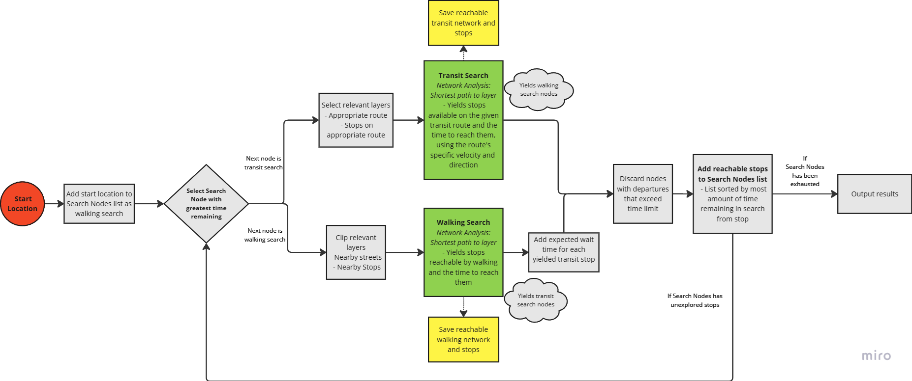

# Portland Transit Service Area Tool

QGIS tool and script to generate a service area layer for any point within the Portland Metro area using public transportation   

# About

A QGIS tool that allows for the user to select a point within an hour's walk of Trimet's bus and rail network and returns the area that is reachable within a provided time limit from that location using the optimal combination of walking and public transit. 
 
The tool was written in Python and returns three layers representing the sections of the street network that can be reached, the transit network that can be reached, and the polygon that contains the city blocks that can be reached within the set time constraint.
 
# Script Details
The script uses publicly available GIS data from Trimet, obtained in fall 2023, that includes Trimet routes and stop locations. 
I obtained and cleaned a spreadsheet containing departure times for each route from each stop to create average velocities and time between departures for each line. This information is used to generate the service area.
 

## [Repository](https://github.com/LukeMitchell-N/PortlandTransitIsochrone)

## Image Gallery

