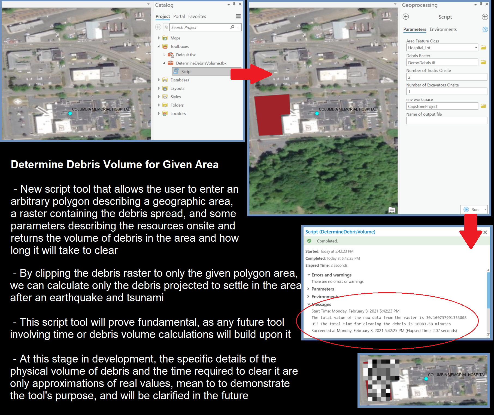
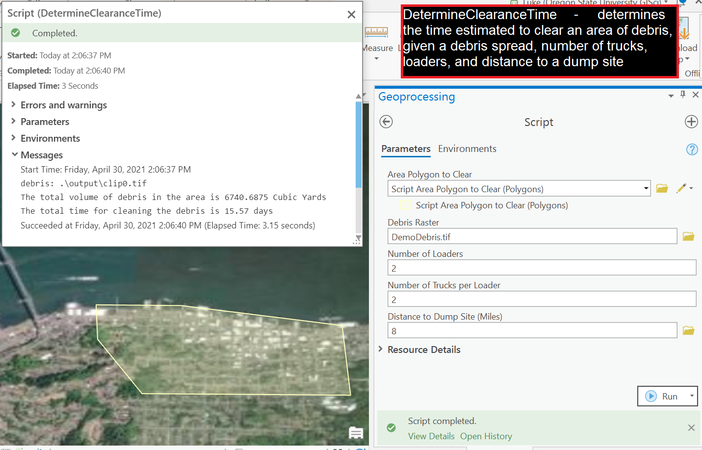

# Geospatial Analysis for Disaster Planning

Final project of my undergraduate program at Oregon State University.   

# About

In this project my team set out to create a collection of tools to allow city emergency managers to better plan for the removal of debris generated by natural disasters. Under the leadership of Dr. Joseph Louis of the department of civil and construction engineering at Oregon State, myself, along with fellow undergraduates Han Jiang, Josiah Metz, and Grace Bullock created toolboxes for use in the ArcGIS suite of applications to give emergency managers more power to plan for disasters. 
 
In the course of the project we aimed to either automate involved processes or create new debris-specific functionality that will improve emergency managers' ability to estimate required resources and plan for disaster recovery. In particular, we created tools that allow a user to quickly determine the total volume of debris in an area given a raster of projected debris spread, and another to determine the time required to clear a given area of debris with the resources at hand. The scope of the project is not limited to the spread of debris, and the future of the project holds new potential features for the impact of disasters on lifeline networks such as roads, water, and electrical networks.

## [Repository](https://github.com/bullocgr/capstone)

## Image Gallery

